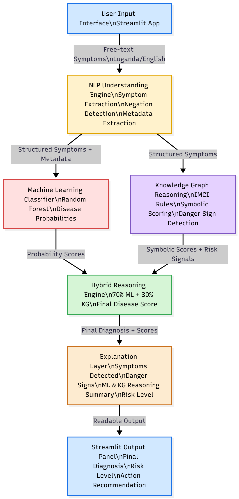

---

## 🏗️ System Architecture

The architecture of this cognitive system follows a **four-layer pipeline**, ensuring clear modularity, interpretability, and clinical relevance.

### **🔹 1. NLP Processing Layer**
- Accepts free-text symptoms in **Luganda or English**
- Cleans and normalizes text
- Detects keywords using a curated medical vocabulary
- Performs negation handling (“sita”, “siko”, “not”, “no”)
- Extracts metadata: **age** and **duration of illness**

### **🔹 2. Machine Learning Layer**
- Takes extracted symptom indicators as input  
- Random Forest model trained on a curated childhood disease dataset  
- Outputs probabilities for:
  - Malaria  
  - Pneumonia  
  - Diarrhea  

### **🔹 3. Knowledge Graph Reasoning Layer**
- Encodes IMCI-style medical associations  
- Rules link symptoms → diseases with weights  
- Handles danger signs (convulsions, lethargy, chest-indrawing)  
- Produces symbolic scores and interpretable rule traces  

### **🔹 4. Hybrid Reasoning Layer**
Combines both approaches:

Final Score = 0.7 × ML_probability + 0.3 × KG_reasoning_score

markdown
Copy code

Provides:
- Final hybrid diagnosis  
- Risk level (Low / Moderate / High)  
- Fired rules for explainability  

### **🔹 5. Streamlit User Interface**
- Simple input box for symptoms  
- Sidebar with ready-made test cases  
- Displays:
  - Diagnosis  
  - Risk  
  - Symptoms detected  
  - ML probabilities  
  - Fired KG rules  
  - Danger signs  

### 📌 Architecture Diagram

*(Place your PNG diagram here in GitHub using the "Upload file" button.)*

Example Markdown:

```markdown

📄 Requirements
The project requires Python libraries for:

NLP text cleaning

Machine learning inference

Knowledge graph reasoning

Streamlit UI deployment

Cloudflare tunneling (for Colab deployment)

Below is the full requirements.txt content you should add to your repository.

📦 requirements.txt
Copy the block below into a file named requirements.txt:

ini
Copy code
streamlit==1.33.0
pandas==1.5.3
numpy==1.23.5
scikit-learn==1.2.2
networkx==3.1
joblib==1.3.2
regex==2023.10.3
langdetect==1.0.9
cloudflared==0.4.0
##Notes:
cloudflared is optional and only needed when running Streamlit in Colab.

Versions are chosen for maximum compatibility with Colab and local environments.